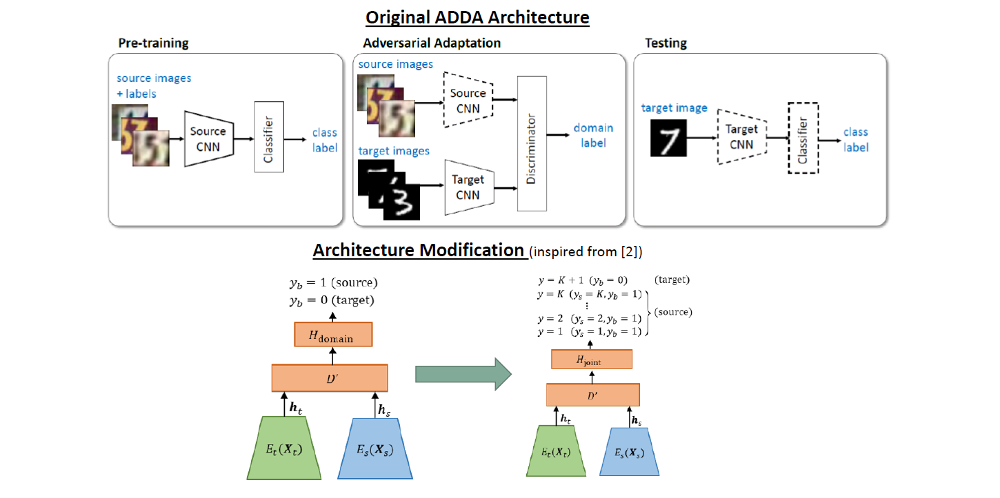

# K-ADDA
In this work, I implement ADDA and modify 2-head Discriminator used in ADDA to a K-head Discriminator in order to leverage the availability of source classes during Adaptation and examine its impact over performance

This work is based on the work - [https://github.com/corenel/pytorch-adda](https://github.com/corenel/pytorch-adda)
